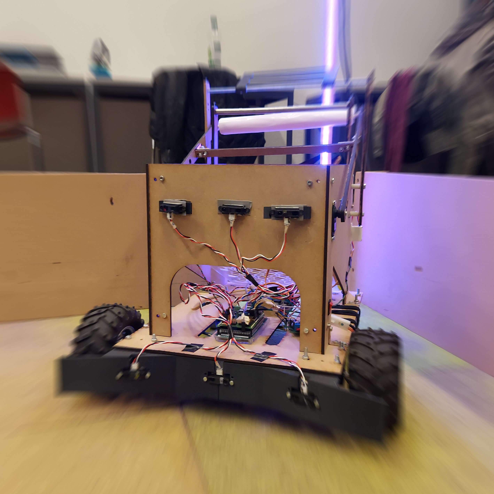

Hello and welcome to our github projejct for our semester project of the fall semester of 2020.
The code is made for a robot that has two see bottles, grap them and bring them to the recycling area. All of this while dodgind obstacles.
The final code is in \TestFinalVersion.
Most of the others repo are mainly test of components that we tested for the robot such as the sensors, the motors and others. 
Now a cool photo of our robot :

