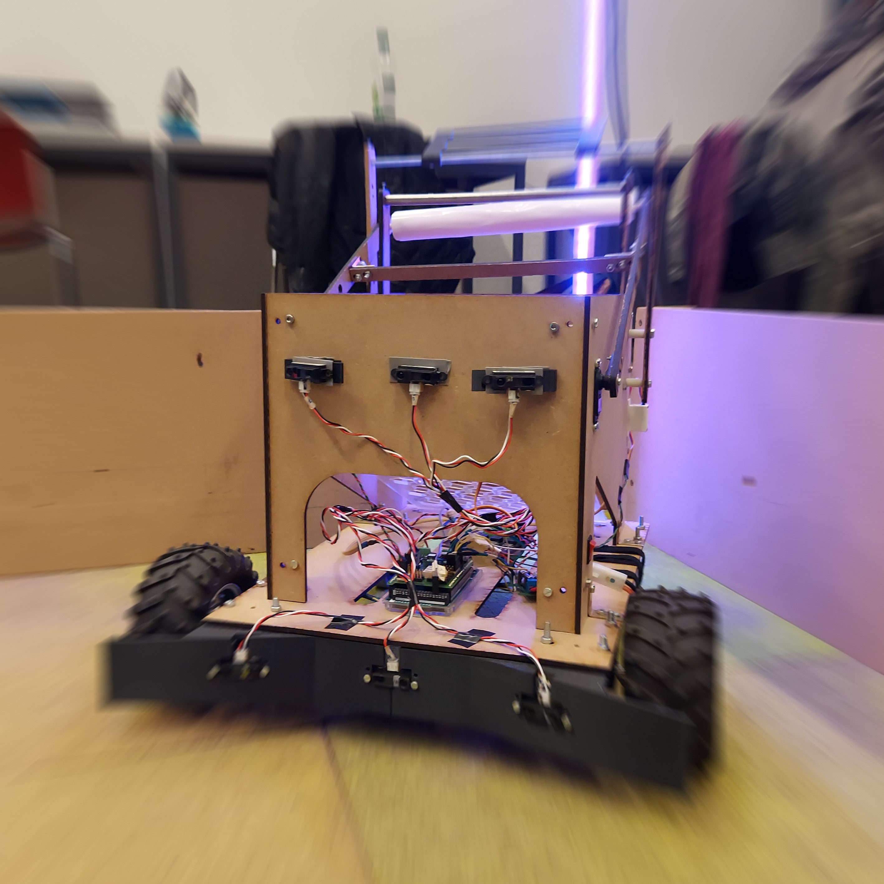

# Galipet code

Hello and welcome to our github project for our semester project of the fall semester of 2020 at EPFL.
The code is made for a robot that has to see bottles, take them and bring them to the recycling area. All of this while dodging obstacles.
The website of the competition can be found  [here](https://robot-competition.epfl.ch/).

The final code is in \GaliPet_Final_Code. You can control the robot using the keyboard in \Move_The_Robot. The file \navigation was made to simulate the navigation. Finally the
\bottleDetection is for trying to detect the bottles.

Most of the others repo are mainly test of components that we tested for the robot such as the sensors, the motors and others. 
Now a cool photo of our robot :

